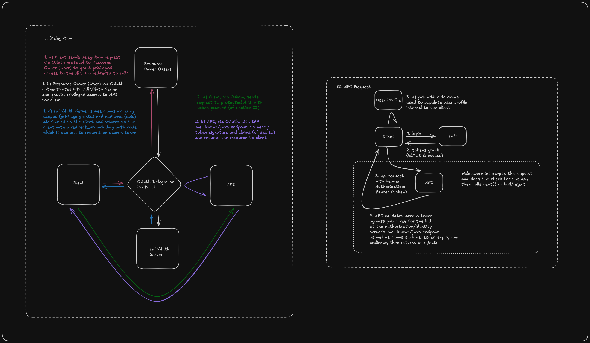

# Auth

- a manning 4 part liveproject beginning with [build an auth server](https://www.manning.com/liveproject/build-an-authorization-server)
- here is my current understanding of how oauth works
  

- building out the first part of the auth server with the following endpoints and reading about how it is based on events got me to thiking perhaps it would make sense to get deeper into this area with some more background before i proceed

  1. /.well-known/jwks.json
  2. .well-known/openid-configuration

## JS Node and Web Streams

- [erick wendell mastering node streams](https://hotmart.com/en/club/masteringnodejsstreams/products/2105756/content/2OM01a8x76)
- i jumped to this course and am bundling it with auth because i feel it may provide some good background material on events processing

---

```bash
node --inspect authorizationServer.js
chrome://inspect
```

## OAuth Flow State Management (code and token)

1. client /authorize

- redirect to server /authorize with query:{state, client_id, redirect_uri, response_type: "code"}

2. server /authorize

- filter for matching client_id, redirect_uri, scopes
- save query in requests[reqid]

```json
// requests object
{
  "nrOdghFy": {
    "response_type": "code",
    "client_id": "oauth-client-1",
    "redirect_uri": "http://localhost:9000/callback",
    "state": "gHddFXaImCl0ao6IGd1mktiDPTeY4hW4"
  }
}
```

- render approve form with client, scope, and reqid
- user POSTS form to /approve endpoint

3. server /approve

-
